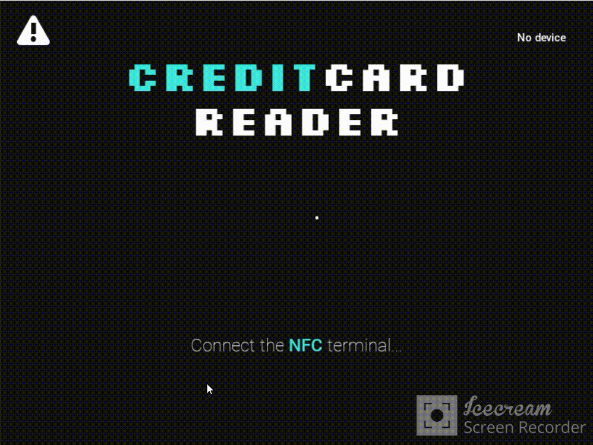
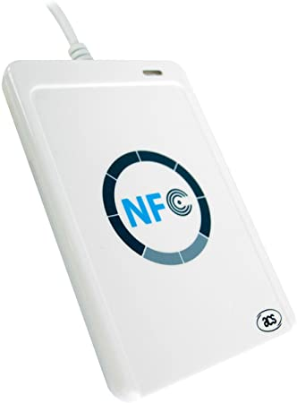

<div id="top"></div>
<!--
*** Thanks for checking out the Best-README-Template. If you have a suggestion
*** that would make this better, please fork the repo and create a pull request
*** or simply open an issue with the tag "enhancement".
*** Don't forget to give the project a star!
*** Thanks again! Now go create something AMAZING! :D
-->


<!-- PROJECT SHIELDS -->
<!--
*** I'm using markdown "reference style" links for readability.
*** Reference links are enclosed in brackets [ ] instead of parentheses ( ).
*** See the bottom of this document for the declaration of the reference variables
*** for contributors-url, forks-url, etc. This is an optional, concise syntax you may use.
*** https://www.markdownguide.org/basic-syntax/#reference-style-links
-->

<!-- PROJECT LOGO -->
<br />
<div align="center">
  <a href="https://github.com/othneildrew/Best-README-Template">
    
  </a>

  <h3 align="center">Credit Card Reader</h3>

  <p align="center">
    Desktop application 4 reading track 2 of EMV credit cards using ACR122u. 
  </p>
    <p align="center">
    Only supports VISA  
  </p>
</div>

<!-- ABOUT THE PROJECT -->
## About The Project



The purpose of this project was to help me understand a little better how credit card transactions work.
Using an NFC reader like ACR122u the program asks for the PDOL chain and creates
the apropiate challenge to get the track 2 chain.



<p align="right">(<a href="#top">back to top</a>)</p>


### Built With

* [Python](https://python.org/)
* [Kivy](https://kivy.org/)
* [KivyMD](https://kivymd.readthedocs.io/)
* [Pyscard](https://github.com/LudovicRousseau/pyscard)

<p align="right">(<a href="#top">back to top</a>)</p>


### Installation

1. Clone the repo
   ```sh
   git clone https://github.com/0xRauros/CreditCardReader.git
   ```
2. Install Python dependencies
   ```sh
   pip install -r requirements.txt
   ```
3. Open the app
   ```sh
   python main.py
   ```

<p align="right">(<a href="#top">back to top</a>)</p>


<!-- ROADMAP -->
## TODO

- [ ] Add BIN checker API
- [ ] Display the Bank Office in a map 

<p align="right">(<a href="#top">back to top</a>)</p>

<!-- LICENSE -->
## License

Distributed under the Beerware License. See `LICENSE.txt` for more information.

<p align="right">(<a href="#top">back to top</a>)</p>

